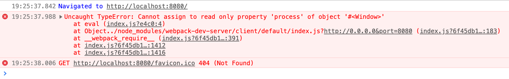

# canary-webpack5-window-process-readonly

## Install

__USE NPM 7__ with this lock file.

`npm install` then `npm start`. Canary should open automatically.

## Bug Report

When Canary `Version 91.0.4446.0 (Official Build) canary (x86_64)` opens, you should see "hello world" in the JS Console, however, the following error is output when the hotreload socket is loaded:

```
index.js?6f45db1514ea19e36fcc:394 Uncaught TypeError: Cannot assign to read only property 'process' of object '#<Window>'
    at eval (index.js?e4c0:4)
    at Object../node_modules/webpack-dev-server/client/default/index.js?http://0.0.0.0&port=8080 (index.js?6f45db1514ea19e36fcc:183)
    at __webpack_require__ (index.js?6f45db1514ea19e36fcc:391)
    at index.js?6f45db1514ea19e36fcc:1412
    at index.js?6f45db1514ea19e36fcc:1416
```

Sometimes the socket script gets cached and you have to hard-reload one or two times to get the error to occur in this sample. For my real code, it's all the time, hard reload or not.

The error is coming from the built version of https://github.com/webpack/webpack-dev-server/blob/master/client-src/default/index.js which has the following injections at the very top of its module:

```
window.global = window.global || window;
window.process = window.process || {};           // <- exception occurs here
window.process.env = window.process.env || {};
```

When this output to the console, you will not see "hello world". In essence, none of the code appears to run.

For my real project, nothing runs, just a blank screen.

But in Chrome `Version 89.0.4389.82 (Official Build) (x86_64)` it works fine, all the code runs. "hello world" is printed in this sample, and in my actual code, my app runs.


